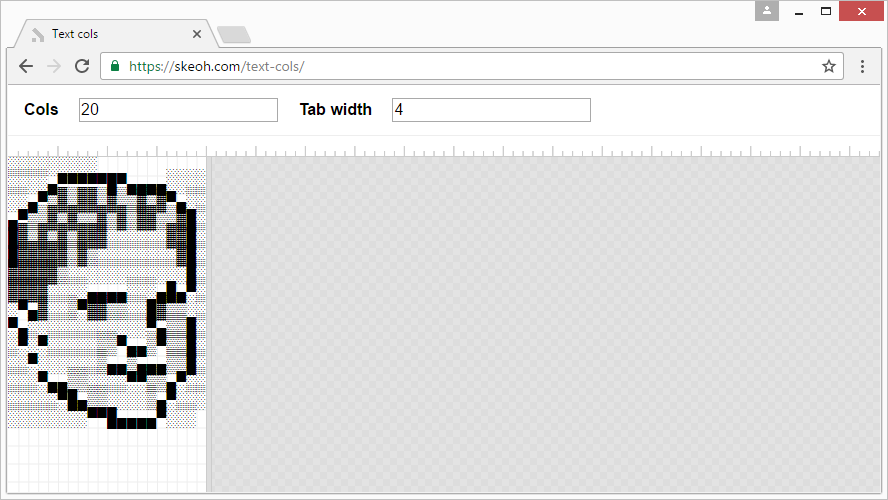

[Text Cols][site]
=================

Resize a textarea by columns.

Used to turn something like this:

    ░░░░░░░░░ ░░░░▄▀▀▀▀▀█▀▄▄▄▄░░░░ ░░▄▀▒▓▒▓▓▒▓▒▒▓▒▓▀▄░░ ▄▀▒▒▓▒▓▒▒▓▒▓▒▓▓▒▒▓█░ █▓▒▓▒▓▒▓▓▓░░░░░░▓▓█░ █▓▓▓▓▓▒▓▒░░░░░░░░▓█░ ▓▓▓▓▓▒░░░░░░░░░░░░█░ ▓▓▓▓░░░░▄▄▄▄░░░▄█▄▀░ ░▀▄▓░░▒▀▓▓▒▒░░█▓▒▒░░ ▀▄░░░░░░░░░░░░▀▄▒▒█░ ░▀░▀░░░░░▒▒▀▄▄▒▀▒▒█░ ░░▀░░░░░░▒▄▄▒▄▄▄▒▒█░ ░░░▀▄▄▒▒░░░░▀▀▒▒▄▀░░ ░░░░░▀█▄▒▒░░░░▒▄▀░░░ ░░░░░░░░▀▀█▄▄▄▄▀░░░

Into this:

[][site]

[site]: https://skeoh.com/text-cols/
